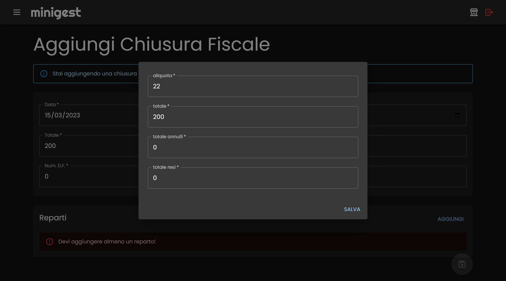

# minigest

un mini gestionale per micro imprese

## Prima di cominciare

Se hai scaricato questo repository o hai intenzione di utilizzare l'immagine docker pubblicata su dockerhub, dovrai utilizzare un file `.env` per gestire tutte le variabili d'ambiente che non possono esserre committate con questo progetto e che sono custom.
Crea un file `.env` nella root del progetto o nella cartella dove ci sarà il tuo `docker-compose.yml` con le seguenti variabili d'ambiente:

```
DB_HOST=mysqldb
MYSQL_ROOT_USER=root
MYSQL_ROOT_PASSWORD=root
MYSQL_DATABASE=minigest

ADMIN_EMAIL=email@email.com
ADMIN_FNAME=Mario
ADMIN_LNAME=Rossi
ADMIN_PASS=54321

EMAIL_HOST=smtp.email.com
EMAIL_USERNAME=email@email.com
EMAIL_PASSWORD=asdfghjkl

HOST=https://minigest.ctrlmaniac.me
```

Ovviamente cambia i valori delle variabili a seconda delle tue necessità!

## Docker

Puoi scaricare e utilizzare liberamente minigest tramite docker! Dai un'occhiata al mio [docker-compose.yml](./docker-compose.prod.yml) per vedere come ho fatto io!

## Cominciamo

### Login

La prima cosa che dovrai fare sarà fare il login! Utilizza i dati che hai inserito nel file `.env` per accedere a minigest!


### Prima configurazione

Durante il primo utilizzo di minigest, ti verrà richiesto di inserire i dati della tua azienda! Compila con cura tutti i campi, ricorda che in seguito quando caricherai le tue fatture (vendita o acquisto) minigest recupererà i dati inseriti nella fattura per salvare in automatico la fattura, quindi i dati dell'azienda devono coincidere con quelli in fattura!


## Con o senza negozio

Puoi utilizzare minigest anche se non hai un negozio!
Se invece hai uno o più negozi, aggiugili subito nella sezione negozi.
Apri il menu con l'icona in alto a sinistra affianco al logo minigest e clicca su negozi. Dopo di che potrai aggiungere i tuoi negozi!


Una volta aggiunto almeno un negozio, potrai selezionarlo cliccando sull'icona in alto a destra, quella che prima aveva il pallino rosa! Minigest selezionerà un negozio a caso per te, quindi se vuoi cambiare visualizzazione, clicca sull'icona e cambia negozio!


## I Corrispettivi

Potrai aggiungere facilmente le chiusure fiscali del tuo negozio nella sezione chiusure fiscali!
Ricorda che ogni chiusura fiscale ha uno o più reparti IVA (le diverse aliquote. es: 22%, 10%, 4%). Aggiungi anche il totale del reparto quando aggiungi una chiusura fiscale!



## Le Fatture

Puoi caricare i tuoi file XML direttamente su minigest, altrimenti puoi compilare manualmente il form delle fatture! Se caricherai i file XML, minigest si occuperà di salvare le eventuali nuove aziende!


